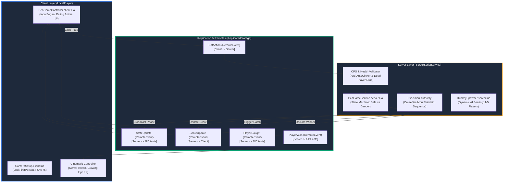

# Pea Game | Architecture & Exploit Resistance Specification

This document provides a technical breakdown of the systems architecture, server authority model, and exploit resistance layers for **Pea Game | Don't Get Caught! 🟢💀**.

---

## 1. System Architecture Diagram



---

## 2. Server Authority & Security Boundaries

### A. Server-Authoritative State Machine
* **Vulnerability Mitigated:** Malicious clients claiming the game is always in `"Safe"` mode.
* **Architecture:** The client never dictates or predicts the game state. The server runs an asynchronous loop choosing randomized durations (`Safe: 3-7s`, `Danger: 2-4s`) and replicates state via `StateUpdate.OnClientEvent`.

### B. RemoteEvent Validation & Auto-Clicker Resistance
* **Vulnerability Mitigated:** Macro software or exploit scripts spamming `EatAction` 1,000 times per second to instantly eat 100 peas in 100 milliseconds.
* **Architecture:** 
  * The server verifies the caller's character, confirms `Humanoid.Health > 0`, and tracks click timestamps to drop requests exceeding human clicking capabilities (CPS throttle).

```lua
-- Verbatim Server Validation Handler
EatAction.OnServerEvent:Connect(function(player)
	local character = player.Character
	local humanoid = character and character:FindFirstChild("Humanoid")
	if not humanoid or humanoid.Health <= 0 then return end
	
	if GAME_STATE == "Danger" then
		if ExecutionInProgress.Value == true then return end
		
		-- Server authorizes death; client cannot dispute
		humanoid.BreakJointsOnDeath = false
		ExecutionInProgress.Value = true
		PlayerCaught:FireAllClients(player)
		
		task.wait(5.0) -- Anime execution delay
		if humanoid.Health > 0 then
			humanoid.Health = 0
		end
		ExecutionInProgress.Value = false
		return
	end
	
	-- Safe to eat 1 pea
	PeasEaten[player.UserId] = (PeasEaten[player.UserId] or 0) + 1
	ScoreUpdate:FireClient(player, PeasEaten[player.UserId])
end)
```

### C. Seated Anti-Bypass Constraint
* **Vulnerability Mitigated:** Exploitative players jumping out of the chair, noclipping around the room, or standing behind the Inspector to avoid detection.
* **Architecture:**
  * Real players are teleported and welded to their designated station's `PlayerSeat`.
  * `Humanoid.JumpPower = 0` and `Humanoid.UseJumpPower = true` are enforced server-side upon character spawning to lock movement.

---

## 3. Dynamic Multiplayer Auto-Balancing

The game dynamically scales from solo play up to a full 5-player human server:

| Active Real Players | Empty Stations | Spawned AI NPCs | Total Table Contestants |
|---|---|---|---|
| **1 Player** (Solo) | 4 | 4 Dummies (`R15_Dummy_1..4`) | **5 / 5** |
| **2 Players** | 3 | 3 Dummies (`R15_Dummy_1..3`) | **5 / 5** |
| **3 Players** | 2 | 2 Dummies (`R15_Dummy_1..2`) | **5 / 5** |
| **4 Players** | 1 | 1 Dummy (`R15_Dummy_1`) | **5 / 5** |
| **5 Players** (Full) | 0 | 0 Dummies | **5 / 5** |

Each AI dummy executes a clicker heuristic, eating peas at randomized human cadence and occasionally triggering the Inspector's detection to keep the room atmospheric and high-tension.

---

## 4. Visual & Audio Pipeline

* **Lighting Engine:** Pitch-black midnight (`ClockTime = 0`), desaturated color grading (`Saturation: -0.35, Contrast: +0.25`), and a shadow-casting overhead cone spotlight (`Angle: 72, Brightness: 3.2`).
* **Cinematic Death FX:** Double-eye socket alignment with twin neon spheres and high-intensity red `PointLight` instances (`Brightness: 4.5, Range: 10`) during the *"Omae Wa Mou Shindeiru"* audio sequence.
* **Sound Engine:** Looping APM horror atmosphere drone (`rbxassetid://1846999567`) initialized directly in `SoundService`.